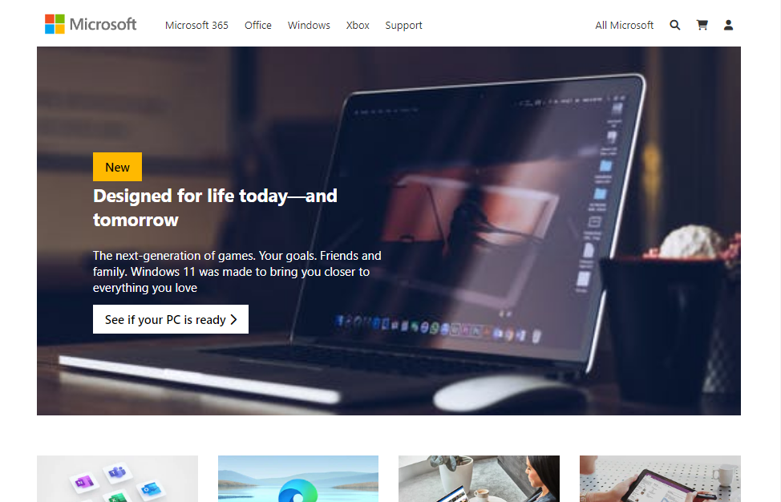
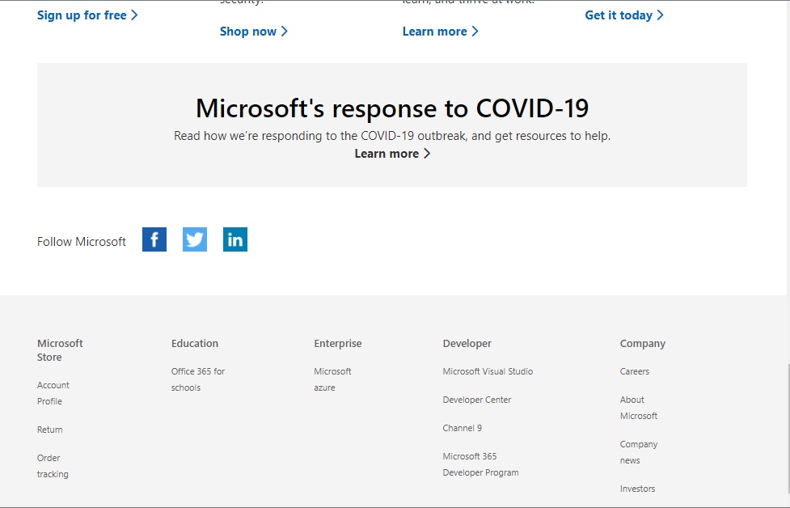
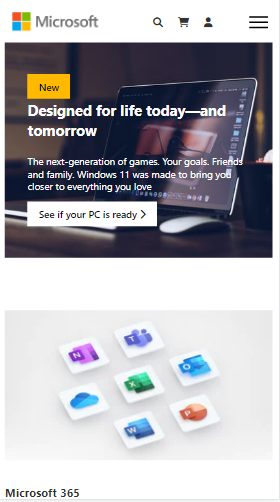
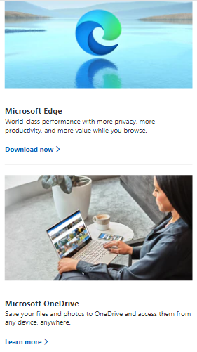
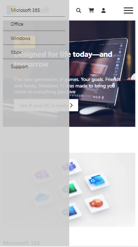

# microsoftclone

> This Project is Microsoft Official Home page Cloning

## Built With

***- Html, Linters, CSS and JavaScript***

## Live Demo
[View project](https://abdulhamiid.github.io/microsoftclone/)
## Getting Started

To get a local copy up and running follow these simple example steps.

### Clone this repository

To clone this repo
```
git clone https://github.com/abdulhamiid/microsoftclone.git
```
To access the cloned directory, run:
```
cd microsoftclone
```

## Screenshotes





### Deployment

Open ```index.html``` in the browser

## Author

👤 **Abdulhamid**

- GitHub: [@githubhandle](https://github.com/abdulhamiid)
- Twitter: [@twitterhandle](https://twitter.com/abdulhamid_adio)
- LinkedIn: [LinkedIn](https://linkedin.com/)

## 🤝 Contributing

Contributions, issues, and feature requests are welcome!

Feel free to check the [issues page](https://github.com/abdulhamiid/microsoftclone/issues).

## Show your support

Give a ⭐️ if you like this project!

## 📝 License

This project is [MIT](./MIT.md) licensed.
